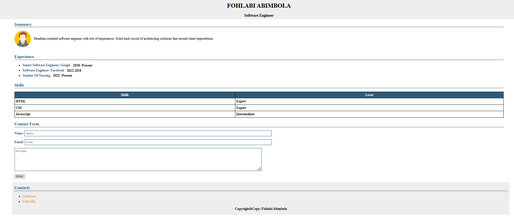

# Portfolio Website README

## Overview
This is a simple portfolio website built using only HTML and CSS. It is designed to showcase personal information, experience, skills, and provide a way for visitors to reach out through a contact form. The website is structured into multiple sections for clarity and ease of navigation.



## Table of Contents
- [Features](#features)
- [Folder Structure](#folder-structure)
- [Technologies Used](#technologies-used)
- [Usage](#usage)
- [Customization](#customization)

## Features
1. **Header**
   - Displays the user's name and role.
2. **Summary Section**
   - Contains an image of the user and a brief "About Me" description.
3. **Experience Section**
   - Lists past job experiences or projects with brief descriptions.
4. **Skills Section**
   - Highlights key skills and the level of expertise in each.
5. **Contact Form Section**
   - Provides a form for visitors to reach out with questions or comments.
6. **Footer**
   - Contains contact information such as email, phone number, and social media links.

## Folder Structure
```
portfolio-website/
│
├── index.html
├── styles/
│   └── style.css
├── images/
│   └── pngegg.png (avatar)
└── README.md
```

## Technologies Used
- **HTML5**: For creating the structure and content of the website.
- **CSS3**: For styling and layout design.

## Usage
1. Clone or download the repository to your local machine.
2. Open `index.html` in your web browser to view the website.

## Customization
- **Header**: Update the name and occupation directly in the HTML file.
- **Summary Section**:
  - Replace `pngegg.png` with your own image in the `images/` folder.
  - Modify the "About Me" text in the HTML.
- **Experience and Skills Sections**:
  - Add or edit job/project descriptions and skills directly in the HTML.
- **Contact Form**:
  - The contact form is a basic form and will need server-side scripting for full functionality (e.g., to send emails).
- **Footer**:
  - Update your contact info (email, phone number, and social media links) in the HTML.

## Example Code Snippets
### Header
```html
<header>
  <h1>John Doe</h1>
  <h2>Software Developer</h2>
</header>
```

### Summary Section
```html
<section id="summary">
  
  <p>Hello! I'm John Doe, a passionate web developer with experience in building user-friendly websites and applications.</p>
</section>
```

### Experience Section
```html
<section id="experience">
  <h3>Experience</h3>
  <ul>
    <li><strong>Company ABC (2021-2023)</strong> - Developed and maintained company website.</li>
    <li><strong>Freelance Projects</strong> - Completed various web development projects for clients.</li>
  </ul>
</section>
```

### Contact Form Section
```html
<section id="contact">
  <h3>Contact Me</h3>
  <form>
    <label for="name">Name:</label>
    <input type="text" id="name" name="name" required>
    <label for="email">Email:</label>
    <input type="email" id="email" name="email" required>
    <label for="message">Message:</label>
    <textarea id="message" name="message" required></textarea>
    <button type="submit">Send</button>
  </form>
</section>
```

### Footer
```html
<footer>
  <p>Contact: johndoe@example.com | Phone: 123-456-7890</p>
  <p>Connect with me on <a href="#">LinkedIn</a>, <a href="#">Twitter</a></p>
</footer>
```

